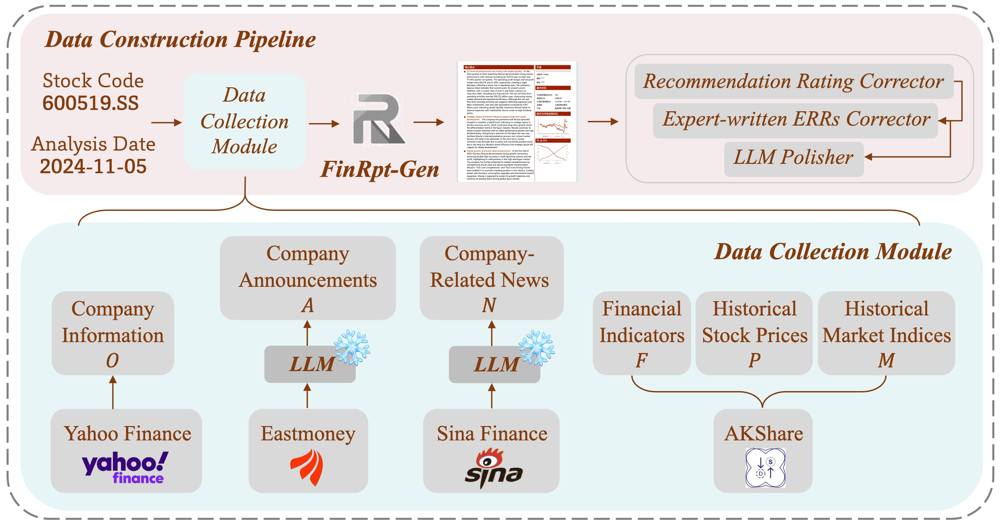
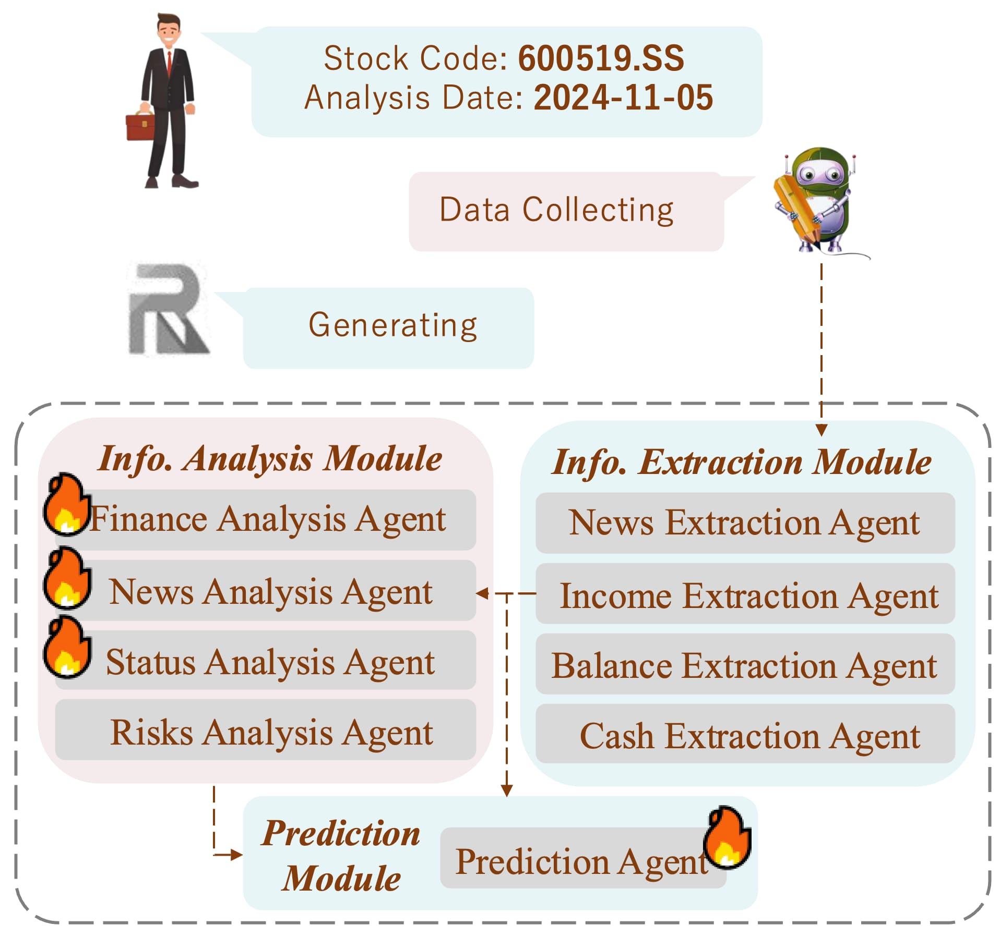

# FinRpt: Dataset, Evaluation System and LLM-based Multi-agent Framework for Equity Research Report Generation

>While LLMs have shown great success in financial tasks like stock prediction and question answering, their application in fully automating Equity Research Report generation remains uncharted territory. In this paper, we formulate the Equity Research Report (ERR) Generation task for the first time. To address the data scarcity and the evaluation metrics absence, we present an open-source evaluation benchmark for ERR generation - FinRpt. We frame a Dataset Construction Pipeline that integrates 7 financial data types and produces a high-quality ERR dataset automatically, which could be used for model training and evaluation. We also introduce a comprehensive evaluation system including 11 metrics to assess the generated ERRs. Moreover, we propose a multi-agent framework specifically tailored to address this task, named FinRpt-Gen, and fine-tune several LLM-based agents on the proposed datasets. Experimental results indicate the data quality and metrics effectiveness of the benchmark FinRpt and the strong performance of FinRpt-Gen, showcasing their potential to drive innovation in the ERR generation field. 


## 🕹️ Environment Setup

1. Create a new virtual environment
```
conda create --name finrpt python=3.10
conda activate finrpt
```
2. Install requirement packages

```
pip install -r requirements.txt
```
3. Add Python environment variables
```
export PYTHONPATH="${PYTHONPATH}:<path_to_this_repo>"
```


## 🔧 Structure

### Dataset Construction Pipeline
<div align="center">

</div>

The corresponding code is in
```
FinRpt/dataset
```

### Data Collect Module

The corresponding code is in
```
FinRpt/finrpt/source
```

### FinRpt Framework
<div align="center">

</div>

The corresponding code is in
```
FinRpt/finrpt/module
```

### Benchmark Evaluation

The corresponding code is in
```
FinRpt/finrpt/benchmark
```

### Fine-tuning LLMs

We use LLaMA-Factory repo to fine-tune LLMs. 

The corresponding code is in

```
FinRpt/finetune/LLaMA-Factory
```

### Website front-end code for FinRpt

You can use the code to build the website for FinRpt and use the website to generate the ERRs conveniently.

The corresponding code is in
```
FinRpt/front
```

## 🌹 Acknowledgmentsons

This project use [LLaMA-Factory](https://github.com/hiyouga/LLaMA-Factory) for mdoels fine-tuning and [ReportLab](https://www.reportlab.com/) for PDF report generation. Special thanks for providing the foundation for this work.

## 📚 License
MIT License

Disclaimer: We are sharing codes for academic purposes under the MIT education license. Nothing herein is financial advice, and NOT a recommendation to trade real money. Please use common sense and always first consult a professional before trading or investing.
